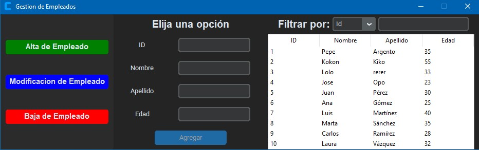

## Descripción del Proyecto

Este proyecto es una **aplicación de escritorio para la gestión de empleados**, desarrollada en Python utilizando las bibliotecas **CustomTkinter**, **Tkinter**, y **SQLite3** como base de datos local. Permite realizar operaciones básicas de **ABM (Alta, Baja y Modificación)** sobre un registro de empleados.



---

## Funcionalidades Principales

- **Agregar (Alta) empleados**: Ingreso de nombre, apellido y edad. Se genera automáticamente un ID.
- **Modificar empleados**: Búsqueda por ID, edición de los campos, y guardado de los cambios.
- **Eliminar empleados**: Eliminación de un registro existente por ID. El ID auto-incremental también se reinicia.
- **Visualización en tiempo real**: Muestra todos los empleados en una tabla (`TreeView`), con filtro en tiempo real por ID, nombre, apellido o edad.
- **Interfaz moderna**: Utiliza `customtkinter` para una interfaz más estética y funcional.
- **Soporte para ejecutables**: Compatible con PyInstaller. Se adapta automáticamente a entornos empaquetados, gracias a la detección del entorno y configuración de la ruta a la base de datos.

---

## Tecnologías utilizadas

- **Python 3**
- **Tkinter**: Biblioteca para crear interfaces gráficas de usuario (GUI).
- **CustomTkinter**: Estilo moderno para los botones y cuadros de texto.
- **SQLite3**: Base de datos local.
- **ttk.Treeview**: Widget de Tkinter para mostrar datos en formato de tabla.

---

## Estructura de la Base de Datos

La base de datos `Bd_Empleados.db` contiene una única tabla llamada `empleados` con la siguiente estructura:

```sql
CREATE TABLE empleados(
    id INTEGER PRIMARY KEY AUTOINCREMENT,
    nombre TEXT NOT NULL,
    apellido TEXT NOT NULL,
    edad INTEGER NOT NULL
)
```
